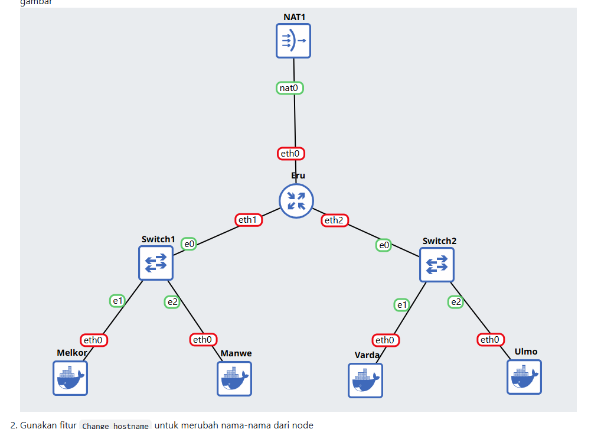
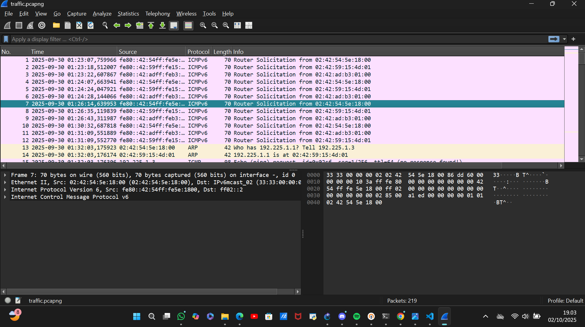
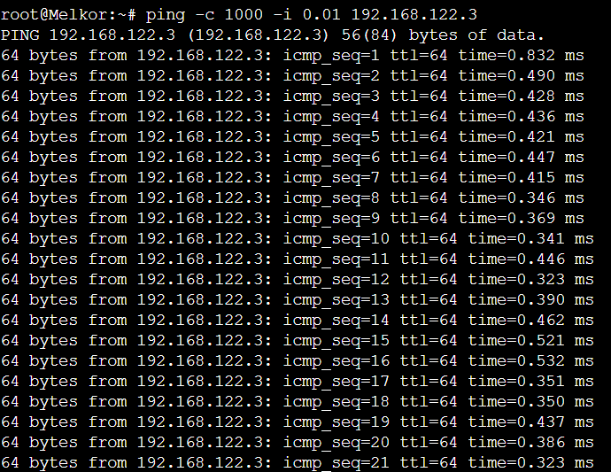
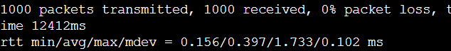
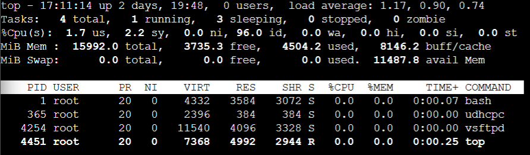
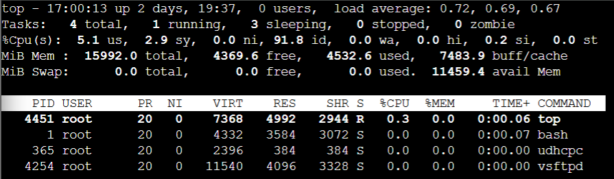

# Jarkom-Modul-1-2025-K-28


## Member

| No  | Nama                   | NRP        |
| --- | ---------------------- | ---------- |
| 1   | Aslam Ahmad Usman      | 5027241074 |
| 2   | Zahra Hafizhah         | 5027241121 |


## Reporting

### Soal 1

Kita membuat sebuah topologi seperti ini


dengan config di masing-masing
Eru
```
auto eth0
iface eth0 inet dhcp

auto eth1
iface eth1 inet static
	address 192.225.1.1
	netmask 255.255.255.0

auto eth2
iface eth2 inet static
	address 192.225.2.1
	netmask 255.255.255.0
```
Melkor
```
auto eth0
iface eth0 inet static
      address 192.225.1.2
      netmask 255.255.255.0
      gateway 192.225.1.1
```
Manwe
```
auto eth0
iface eth0 inet static
	address 192.225.1.3
	netmask 255.255.255.0
	gateway 192.225.1.1
```
Varda
```
auto eth0
iface eth0 inet static
	address 192.225.2.2
	netmask 255.255.255.0
	gateway 192.225.2.1
```
Ulmo
```
auto eth0
iface eth0 inet static
	address 192.225.2.3
	netmask 255.255.255.0
	gateway 192.225.2.1
```

### Soal 4
Untuk memastikan agar mereka tersambung ke internet maka menggunakan command
```
ping google
```
atau
```
ping 8080
```

### soal 6
```
wget --no-check-certificate "https://drive.google.com/uc?export=download&id=1bE3kF1Nclw0VyKq4bL2VtOOt53IC7lG5" -O traffic.zip
```
kemudian bisa unzip traffic.zip

untuk beri izin
```
chmod +x traffic.zip
```
kemudian ke wireshark > start capture

untuk menjalankan 
```
./traffic.sh
```


### Soal 7
Langkah awal install FTP Server
```
apt install vfstpd
vfstpd -v
```
Buat direktori yang namanya shared
```
mkdir -p /rara/shared
```
Kalo udah buat user Ainur sama Melkor
```
adduser ainur
adduser melkor
```
Menjalankan FTP server
```
service vsftpd restart
ftp localhost
```
Buat kasih izin ke ainur biar file shared jadi milik dia
```
chown ainur : ainur shared
chmod ainur 700 shared
cd shared
```
Kalau mau login bisa pake
```
su ainur
```
Buat file baru pake
```
touch
```

Kalau Melkor gak bisa jadi user karena izin hanya untuk Ainur


### Soal 10


Untuk soal ini cukup melakukan spam command ping dalam jumlah besar kepada Eru. 




Setelah itu melihat average round trip time di akhir command ping.



 
Dari hasil average round trip time, dapat dilihat bahwa terdapat 0% packet loss yang artinya tidak ada paket yang hilang, avg = 0.397 ms yang artinya waktu rata-rata back and forth termasuk sangat kecil. Dari hasil tersebut dapat disimpulkan bahwa serangan ping dalam jumlah besar tidak memengaruhi kinerja mode Eru. CPU user-space juga dapat dilihat untuk memberikan bukti yang lebih jauh:




Disini CPU user-space mengalami kenaikan kecil dari 1.8% ke 5.0% us, yang juga masih rendah dan tidak menunjukkan tanda overload.
