# Jarkom-Modul-1-2025-K-28


## Member

| No  | Nama                   | NRP        |
| --- | ---------------------- | ---------- |
| 1   | Aslam Ahmad Usman      | 5027241074 |
| 2   | Zahra Hafizhah         | 5027241121 |


## Reporting

### Soal 1

Kita membuat sebuah topologi seperti ini


dengan config di masing-masing
Eru
```
auto eth0
iface eth0 inet dhcp

auto eth1
iface eth1 inet static
	address 192.225.1.1
	netmask 255.255.255.0

auto eth2
iface eth2 inet static
	address 192.225.2.1
	netmask 255.255.255.0
```
Melkor
```
auto eth0
iface eth0 inet static
      address 192.225.1.2
      netmask 255.255.255.0
      gateway 192.225.1.1
```
Manwe
```
auto eth0
iface eth0 inet static
	address 192.225.1.3
	netmask 255.255.255.0
	gateway 192.225.1.1
```
Varda
```
auto eth0
iface eth0 inet static
	address 192.225.2.2
	netmask 255.255.255.0
	gateway 192.225.2.1
```
Ulmo
```
auto eth0
iface eth0 inet static
	address 192.225.2.3
	netmask 255.255.255.0
	gateway 192.225.2.1
```

### Soal 4
Untuk memastikan agar mereka tersambung ke internet maka menggunakan command
```
ping google
```
atau
```
ping 8080
```

### soal 6
```
wget --no-check-certificate "https://drive.google.com/uc?export=download&id=1bE3kF1Nclw0VyKq4bL2VtOOt53IC7lG5" -O traffic.zip
```
kemudian bisa unzip traffic.zip

untuk beri izin
```
chmod +x traffic.zip
```
kemudian ke wireshark > start capture

untuk menjalankan 
```
./traffic.sh
```


### Soal 7
Langkah awal install FTP Server
```
apt install vfstpd
vfstpd -v
```
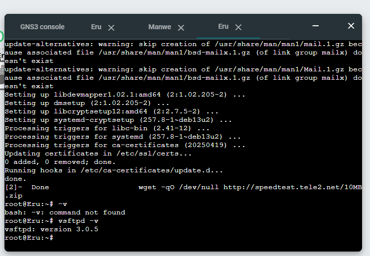
Buat direktori yang namanya shared
```
mkdir -p /rara/shared
```
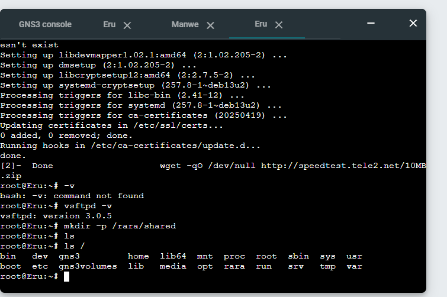
Kalo udah buat user Ainur sama Melkor
```
adduser ainur
adduser melkor
```
Menjalankan FTP server
```
service vsftpd restart
ftp localhost
```
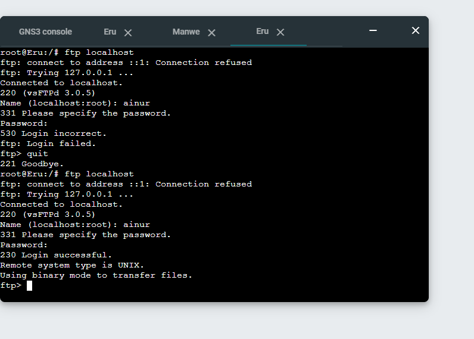
Buat kasih izin ke ainur biar file shared jadi milik dia
```
chown ainur : ainur shared
chmod ainur 700 shared
cd shared
```
Kalau mau login bisa pake
```
su ainur
```
Buat file baru pake
```
touch
```
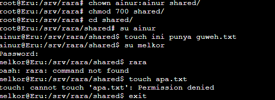
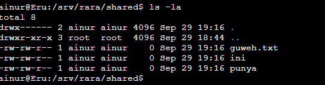

Kalau Melkor gak bisa jadi user karena izin hanya untuk Ainur

### Soal 8


Hal pertama yang dilakukan adalah mendapatkan file yang terdapat pada google drive di node Ulmo. File txt dapat di copy dengan nano sedangkan image di convert menjadi base64.


Selanjutnya node Ulmo melakukan koneksi ke server FTP eru sebagai client dengan `ftp IP Port`.


Setelah masuk dapat melakukan login pada user ainur.


Setelah itu menjalankan `start capture` di link komunikasi antara Ulmo dan Eru dan mulai mengupload kedua file dari soal.


Setelah membuka wireshark dan menerapkan display filter `ftp`, maka data ftp yang sudah diupload sebelumnya akan muncul. Untuk melihat perintah client ke server Eru dapat menggunakan STOR.


### Soal 9

Soal 9


Sebelum mulai pastikan FTP server sudah jalan dengan `vsftpd`.
```c
root@Eru:~# service vsftpd
status FTP server is running.
```

Jika sudah maka file `Kitab Penciptaan` ditaruh pada direktori ftp dan mengubah user ainur menjadi read only.
```c
ainur@Eru:~$ cp kitab_penciptaan.txt /home/ainur/ftp/
ainur@Eru:~$ chmod 444 /home/ainur/ftp/kitab_penciptaan.txt
```

Sebelumnya kita bisa menguji read-only access dengan `put`

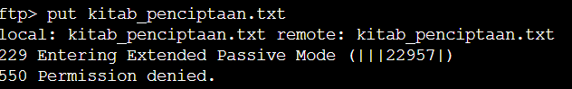


Di node Manwe, login ke FTP server Eru pakai user ainur dan download file pada direktori

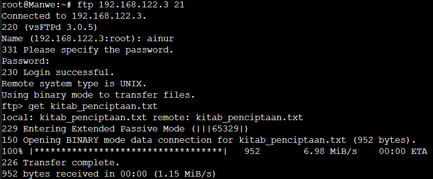


Jika sudah maka selanjutnya adalah melakukan capture dengan wireshark


### Soal 10


Untuk soal ini cukup melakukan spam command ping dalam jumlah besar kepada Eru. 


Setelah itu melihat average round trip time di akhir command ping.


 
Dari hasil average round trip time, dapat dilihat bahwa terdapat 0% packet loss yang artinya tidak ada paket yang hilang, avg = 0.397 ms yang artinya waktu rata-rata back and forth termasuk sangat kecil. Dari hasil tersebut dapat disimpulkan bahwa serangan ping dalam jumlah besar tidak memengaruhi kinerja mode Eru. CPU user-space juga dapat dilihat untuk memberikan bukti yang lebih jauh:


Disini CPU user-space mengalami kenaikan kecil dari 1.8% ke 5.0% us, yang juga masih rendah dan tidak menunjukkan tanda overload.

### Soal 14

```
nc 10.15.43.32 3401
```
Kemudian membuka file wireshark nya untuk menjawab total pocket ada di bagian bawah kanan
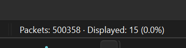

Nah untuk soal-soal selanjutnya bisa menggunakan filter untuk mencari user dan passwordnya, kemudian akan mendapatkannya lewat follow > tcp stream > (lupa bukti screenshootnya)
Setelah mendapat hasil di no 2, 3 dan  akan mendapat flagnya
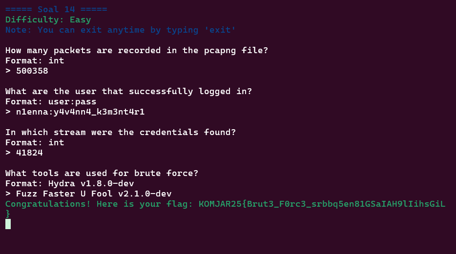

### Soal 16

```
nc 10.15.43.32 3403
```

filter 
```
ftp.request.command == "USER" or ftp.request.command == "PASS"
```
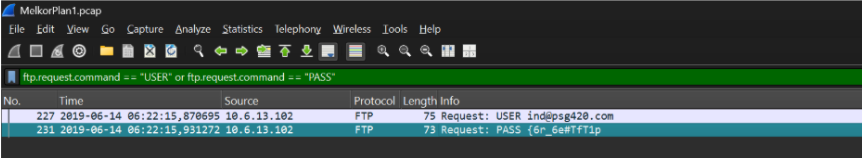
Cari yang sesuai sama file yang diminta, misal q, w, x
Nah, kemudian bisa klik kanan > tcp stream > save as raw 
save raw -buka ubuntu
```
sha256sum q.exe 
sha256sum w.exe
sha256sum r.exe
```
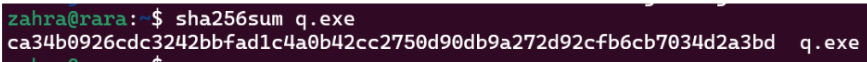
flag
```
Congratulations! Here is your flag: KOMJAR25{Y0u_4r3_4_g00d_4nalyz3r_Htq7CPtj1bfCL614kLe4hMlq7}
```
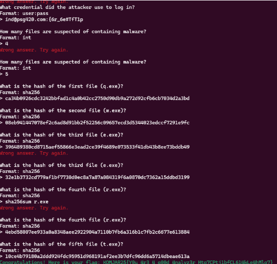

### Soal 17

```
nc 10.15.43.32 3404
```
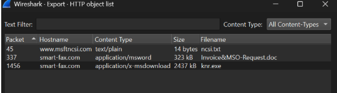
file > eksport object > follow > http stream
cari jawaban buat soalnya ada disitu

save raw  > buka ubuntu
```
sha256sum knr.exe
```
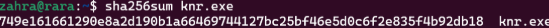
flag
```
Congratulations! Here is your flag: KOMJAR25{M4ster_4n4lyzer_XoqK9EdCYy4M326Y3xlrh0w43}
```
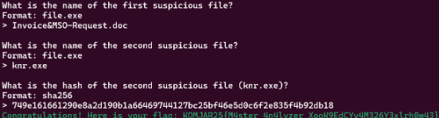

### Soal 18

```
nc 10.15.43.32 3405
```

pake filter
```
frame contain "exe"
```
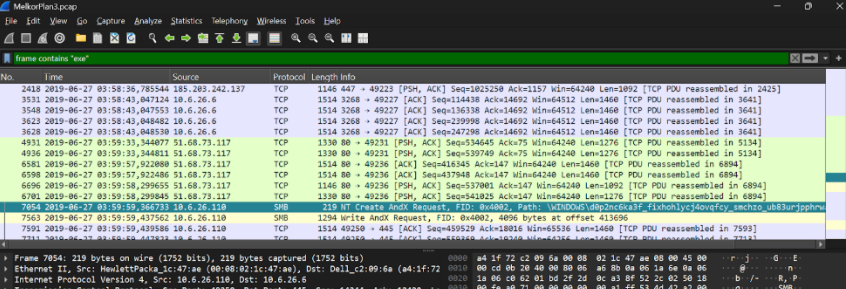

save -> file > eksport smb
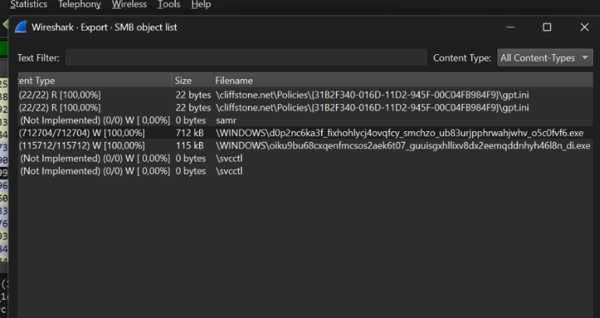
Buat cari jawaban file sha
```
sha256sum file.exe
```

flag
```
Congratulations! Here is your flag: KOMJAR25{Y0u_4re_g0dl1ke_SSnVa8hdCwkQ07iFBoLW82h1t}
```
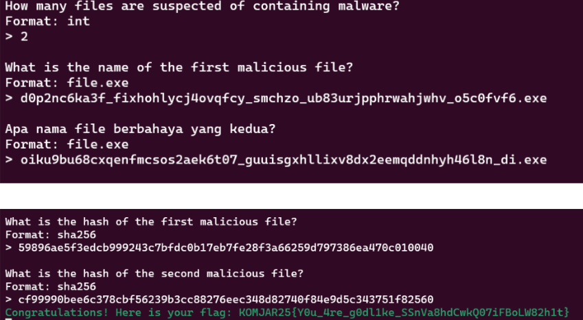

### Soal 19
```
nc 10.15.43.32 3406
```

paket capture > follow tcp stream
Nah untuk menjawab soal-soalnya ada isinya kayak gini
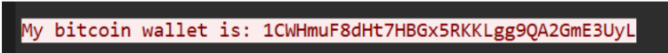
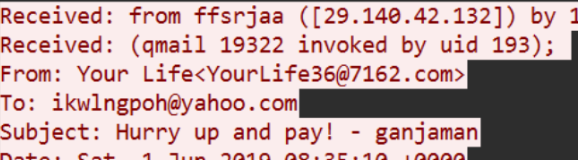
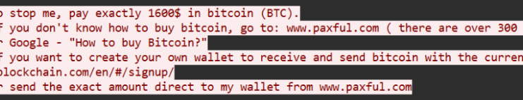

flag
```
Congratulations! Here is your flag: KOMJAR25{Y0u_4re_J4rk0m_G0d_yTKdjZQBydCmGmdYvJY4D3xrP}
```
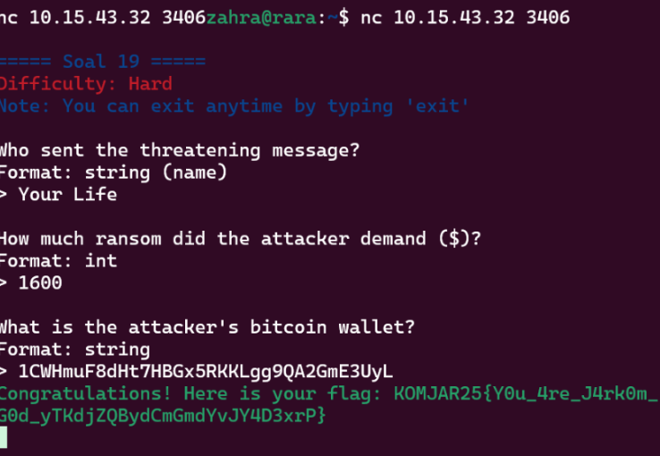

### Soal 20

```
nc 10.15.43.32 3407
```

edit > preference > cari TLS di 165 > export object list > save invest_20.dll
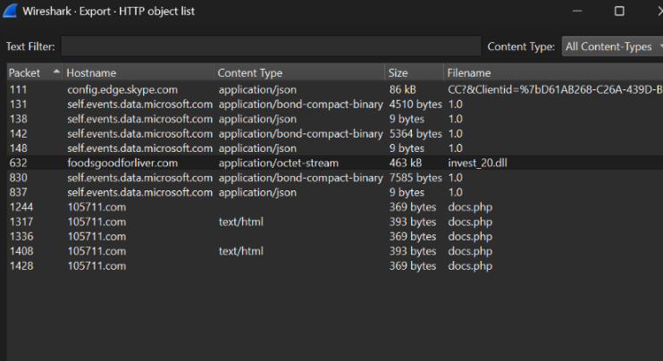

flag
```
Congratulations! Here is your flag: KOMJAR25{B3ware_0f_M4lw4re_MPPX7WnbgAupLWnq1EavOBuKV}
```
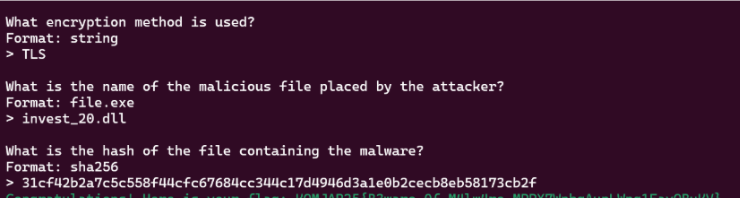


